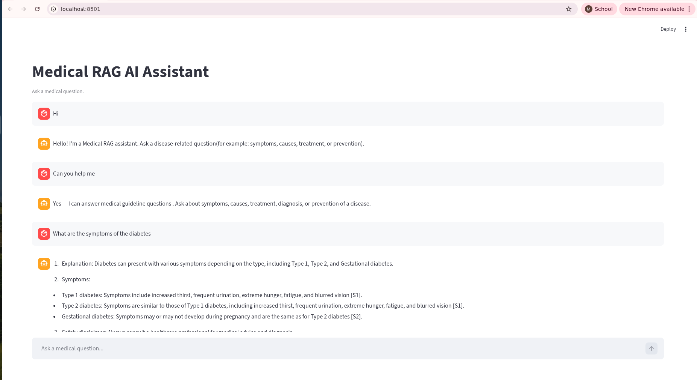
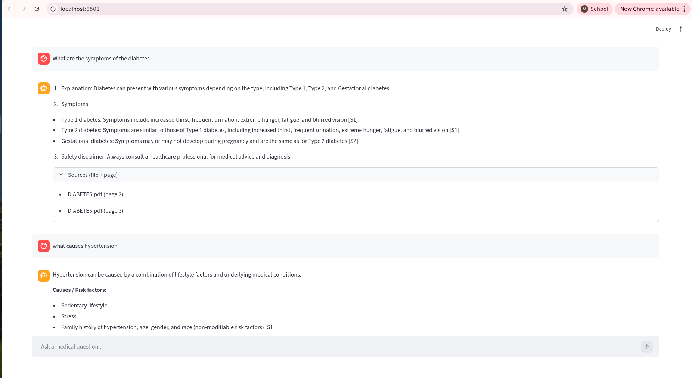
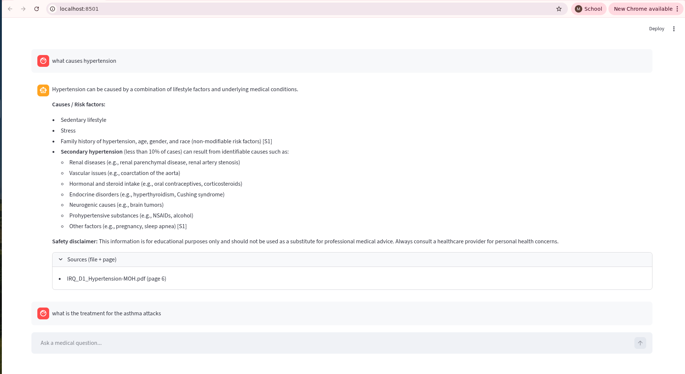
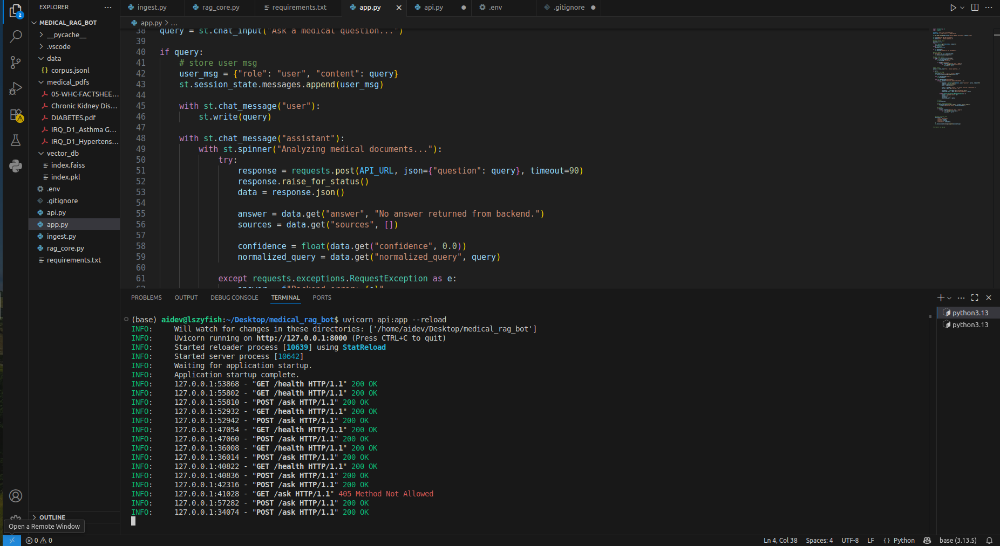
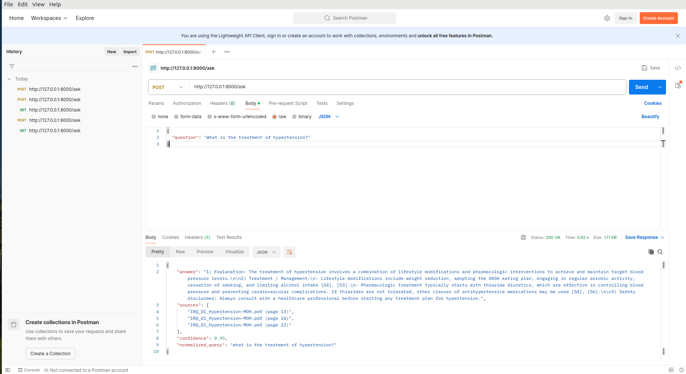

# medical-rag-ai-assistant
Medical RAG app built with FastAPI and Streamlit using FAISS + BM25 hybrid retrieval for accurate PDF-based question answering.
# Medical RAG AI Assistant (FastAPI + Streamlit + FAISS + BM25)

A production-style **Medical RAG (Retrieval-Augmented Generation) Assistant** that answers medical guideline questions from **local PDF documents only**.

This project combines:

- **PDF ingestion pipeline** (chunking + metadata + FAISS + JSONL corpus)
- **Hybrid retrieval** using **FAISS (vector search)** + **BM25 (keyword search)**
- **RRF fusion** (Reciprocal Rank Fusion) for better retrieval ranking
- **Strict disease-to-file filtering** to prevent mixed-document answers
- **FastAPI backend** for real-time API responses
- **Streamlit frontend** for interactive chat UI
- **Source citations (file + page)** + confidence score in responses

---

## Table of Contents

- [Project Overview](#project-overview)
- [Key Features](#key-features)
- [Tech Stack](#tech-stack)
- [How It Works](#how-it-works)
- [Project Structure](#project-structure)
- [Supported Diseases (Whitelist)](#supported-diseases-whitelist)
- [Setup Instructions](#setup-instructions)
- [Environment Variables](#environment-variables)
- [Run the Project](#run-the-project)
- [API Usage](#api-usage)
- [Streamlit App Usage](#streamlit-app-usage)
- [Screenshots](#screenshots)

---

## Project Overview

This project is a **Medical RAG chatbot** built to answer disease-related questions such as:

- **Symptoms**
- **Causes / Risk factors**
- **Treatment / Management**
- **Diagnosis**
- **Prevention**

The system retrieves relevant chunks from your **medical PDF guidelines**, then generates an answer with **citations** like `[S1]`, `[S2]`, and returns the **source file + page** in the response.

### What makes this project stronger than a basic RAG demo?

- Query normalization for spelling mistakes (e.g., `hypertenshion` → `hypertension`)
- Intent classification (greeting / smalltalk / medical / non-medical / feedback)
- Hybrid retrieval (**FAISS + BM25**)
- Reciprocal Rank Fusion (**RRF**)
- Strict disease-specific document filtering
- Citation validation and source-only output
- FastAPI + Streamlit integration

---

## Key Features

### 1) PDF Ingestion Pipeline (`ingest.py`)
- Loads PDFs from `medical_pdfs/`
- Adds metadata:
  - `disease`
  - `source_file`
  - `page`
- Splits text into chunks using `RecursiveCharacterTextSplitter`
- Creates stable `chunk_id` using SHA1 hash
- Generates embeddings using `OpenAIEmbeddings`
- Stores vectors in **FAISS**
- Exports corpus to `data/corpus.jsonl` for **BM25**

### 2) Hybrid Retrieval (`rag_core.py`)
- **FAISS** semantic retrieval (MMR search)
- **BM25** keyword retrieval (`rank-bm25`)
- **RRF fusion** to combine rankings from both methods
- Returns top-ranked chunks for answer generation

### 3) Query Normalization + Intent Routing
- Fixes common misspellings and joined words (e.g., `treatmentof`, `hypertenshion`)
- Intent categories:
  - Greeting
  - Smalltalk
  - Feedback
  - Non-medical
  - Medical

### 4) Disease Detection + Section Detection
- Detects disease from user query (e.g., hypertension, diabetes, asthma, CKD)
- Detects requested sections:
  - symptoms
  - causes/risk factors
  - treatment/management
  - diagnosis
  - prevention

### 5) Strict Disease Filtering (Guardrail)
- Uses `DISEASE_FILE_WHITELIST` to restrict sources to the correct disease file(s)
- Helps avoid mixed answers across different diseases

### 6) Controlled Answer Generation
- LLM is instructed to:
  - use **only provided sources**
  - add citations for factual claims
  - return **`Not found in documents.`** when unsupported
  - avoid mixing diseases

### 7) API + Frontend
- **FastAPI** backend exposes `/health` and `/ask`
- **Streamlit** frontend provides a chat interface with:
  - answer display
  - normalized query hint
  - sources (file + page)
  - session memory in UI

---

## Tech Stack

- **Python**
- **LangChain**
- **OpenAI Embeddings**
- **OpenAI Chat Model**
- **FAISS** (vector database)
- **BM25** (`rank-bm25`)
- **FastAPI**
- **Streamlit**
- **Pydantic**
- **python-dotenv**
- **pypdf**
- **tiktoken**

---

## How It Works

### Step 1 — Ingest PDFs (`ingest.py`)
- Reads PDFs from `medical_pdfs/`
- Loads pages using `PyPDFLoader`
- Adds metadata (`disease`, `source_file`, `page`)
- Splits documents into chunks
- Generates embeddings and stores them in FAISS
- Saves BM25 corpus to `data/corpus.jsonl`

### Step 2 — Retrieval + Answering (`rag_core.py`)
- Normalizes the user query
- Classifies query intent
- Detects disease + requested section(s)
- Retrieves relevant chunks via:
  - FAISS (MMR)
  - BM25
- Combines results using **RRF**
- Applies strict disease filtering
- Builds a source context (`[S1]`, `[S2]`, ...)
- Generates answer with LLM
- Validates citations and returns:
  - `answer`
  - `sources`
  - `confidence`
  - `normalized_query`

### Step 3 — FastAPI + Streamlit
- **`api.py`** exposes endpoints for health + question answering
- **`app.py`** provides a Streamlit chat UI and calls FastAPI backend

---


### Screenshots

This section shows the working UI and API flow of the **Medical RAG AI Assistant**, including the Streamlit chat interface, FastAPI backend execution, and API testing in Postman.

### 1) Streamlit Chat — Example 1 (Simple Medical Query)
This screenshot shows the Streamlit frontend handling a basic medical question and returning a response generated from the uploaded PDFs.



### 2) Streamlit Chat — Example 2 (Another Query Response)
This screenshot demonstrates another medical question in the Streamlit chat UI, showing the chatbot’s response and document-based answering behavior.



### 3) Streamlit Chat — Example 3 (Chat Interaction / Result View)
This screenshot shows an additional chat example, highlighting the interactive conversation flow and response rendering in the frontend.



### 4) FastAPI Backend Running in Terminal
This screenshot shows the FastAPI backend server running locally using Uvicorn, which powers the `/health` and `/ask` endpoints for the Streamlit app.



### 5) Postman API Test (`/ask` Endpoint)
This screenshot shows a successful API test in Postman, where a medical question is sent to the backend and a JSON response is returned with:
- `answer`
- `sources`
- `confidence`
- `normalized_query`



---

## Project Structure

> This matches your current project structure shown in VS Code.

```bash
MEDICAL_RAG_BOT/
│
├── __pycache__/
├── .vscode/
│
├── data/
│   └── corpus.jsonl
│
├── medical_pdfs/
│   ├── 05-WHC-FACTSHEE...pdf
│   ├── Chronic Kidney Dis...pdf
│   ├── DIABETES.pdf
│   ├── IRQ_D1_Asthma G...pdf
│   └── IRQ_D1_Hypertens...pdf
│
├── screenshots/
│   ├── fastapi_terminal.png
│   ├── postman_test.png
│   ├── streamlit_chat_1.png
│   ├── streamlit_chat_2.png
│   └── streamlit_chat_3.png
│
├── vector_db/
│   ├── index.faiss
│   └── index.pkl
│
├── .env
├── .gitignore
├── api.py                  # FastAPI backend
├── app.py                  # Streamlit frontend
├── ingest.py               # PDF ingestion + FAISS + corpus generation
├── rag_core.py             # Core RAG logic (hybrid retrieval + guardrails)
├── requirements.txt
└── README.md
```
---
